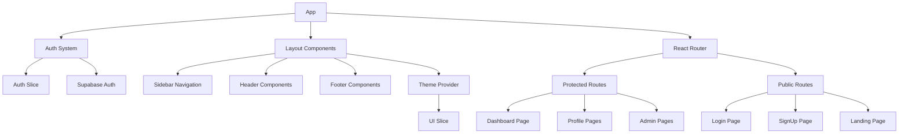
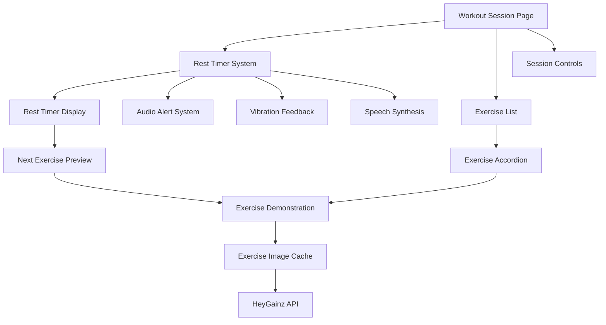
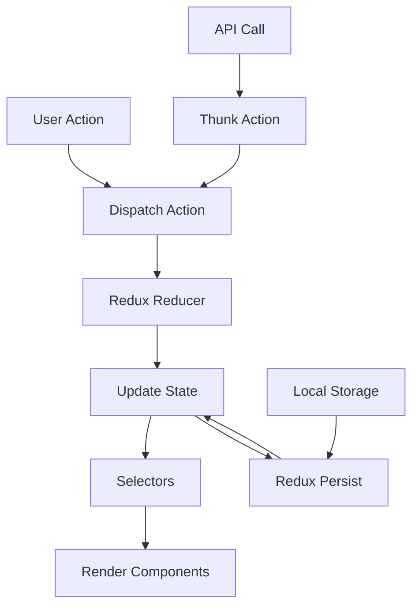
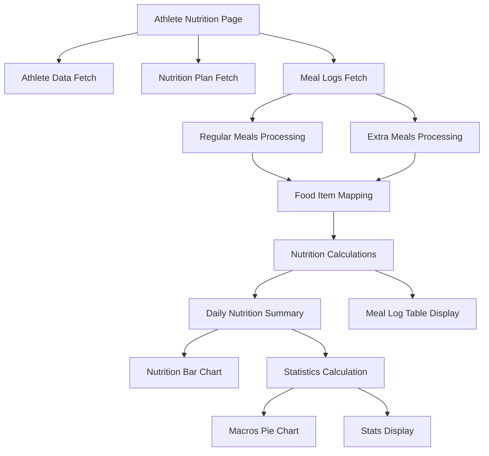
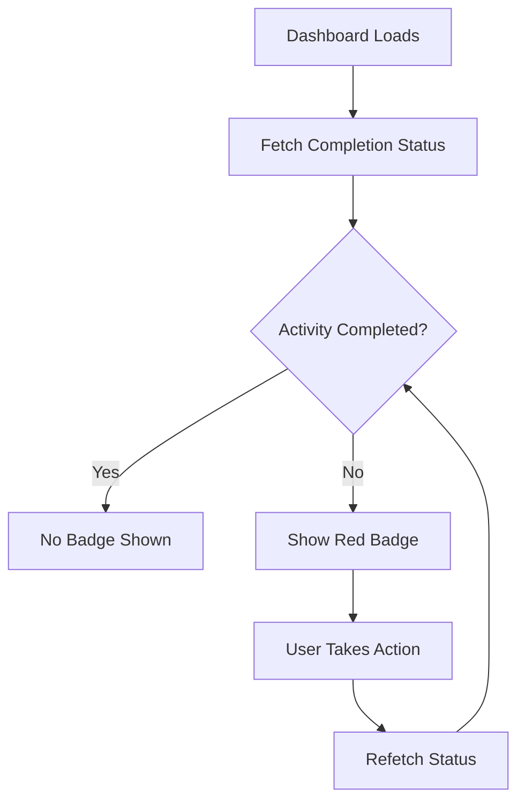
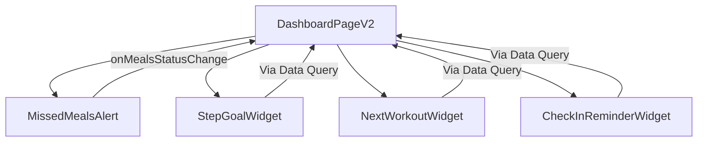

# System Patterns: ENG App

## 1. Architecture Overview

*   **Full-Stack Web Application:** Single Page Application (SPA) frontend with a backend API.
*   **Frontend:** React 18 + Vite, TypeScript, React Router v6 for client-side routing with code-splitting.
*   **Backend/API:** Supabase (BaaS) providing Authentication, PostgreSQL Database (with Row-Level Security), and Storage.
*   **State Management:** Redux Toolkit, with persistence to IndexedDB for offline capabilities (workout data, current meal plan).
*   **Styling:** Tailwind CSS (utility-first approach), including built-in dark mode support.
*   **Forms:** React Hook Form paired with Zod for schema-based validation.
*   **Deployment:** Continuous Integration/Continuous Deployment (CI/CD) via GitHub Actions, deploying to Vercel or Netlify (TBD), including preview deployments.

## 2. Key Technical Decisions & Patterns

*   **Mobile-First Responsive PWA:** The application must be designed for mobile devices primarily and function as a Progressive Web App, including offline caching for specific routes (e.g., workout pages, current meal plan).
*   **Component-Based UI:** Leverage React's component model.
*   **Utility-First CSS:** Use Tailwind CSS for styling.
*   **Schema-Driven Forms:** Employ Zod for robust form validation.
*   **Database:** Supabase PostgreSQL with Row Level Security (RLS) enforced.
*   **Exercise Data:** Local Supabase database instead of external HeyGainz API, providing better reliability and control.
*   **Authentication:** Supabase Auth using Email Magic Link.
*   **Data Ingestion:** One-time script (`scripts/ingest-afcd.js`) used to populate `food_items` from the AFCD Excel source.

## 3. Data Models (High-Level)

```text
// User Centric Model
User
 ├─ profile: (age, weight, height, bodyFat%, goals, demographics, training habits, nutrition habits, lifestyle info, supplements/meds, motivation)
 ├─ stepGoal: (dailySteps: number)
 ├─ program: (ref → ProgramTemplate)
 ├─ mealPlan: (ref → NutritionPlan)
 └─ checkIns: (array → CheckIn)

// Program Structure
ProgramTemplate
 ├─ name: string
 ├─ phase: string
 ├─ weeks: number
 └─ workouts: (array → ExerciseInstance) // Linked to Exercise DB ID

// Nutrition Structure
NutritionPlan
 ├─ name: string
 ├─ totalCalories: number
 ├─ macros: { protein: number, carbs: number, fat: number }
 └─ meals: (array → MealFoodItem → FoodItem) // Linked to AFCD ID via FoodItem

FoodItem // Populated from AFCD, stored in `food_items` table
 ├─ id: uuid
 ├─ afcd_id: text (unique)
 ├─ food_name: text
 ├─ food_group: text
 ├─ calories_per_100: float8 // Note: Based on nutrient_basis
 ├─ protein_per_100: float8  // Note: Based on nutrient_basis
 ├─ carbs_per_100: float8    // Note: Based on nutrient_basis
 ├─ fat_per_100: float8      // Note: Based on nutrient_basis
 ├─ fiber_per_100: float8    // Note: Based on nutrient_basis
 ├─ serving_size_g: float8
 ├─ serving_size_unit: text
 └─ nutrient_basis: text ('100g' or '100mL') // Indicates unit for nutrient values

MealFoodItem // Junction table: links Meal to FoodItem with quantity
 ├─ meal_id: uuid
 ├─ food_item_id: uuid
 ├─ quantity: float8
 └─ unit: text (e.g., 'g', 'slice', 'cup')

// Check-in Details
CheckIn
 ├─ date: timestamp
 ├─ photos: (array → URL/storage ref)
 ├─ video?: (URL/storage ref)
 ├─ bodyMetrics: { weight: number, measurements: object } // Specific measurements TBD
 ├─ wellnessMetrics: { sleep: number, stress: number, fatigue: number } // Ratings or specific metrics TBD
 └─ adherence: { diet: string, training: string, steps: string, notes: string } // Could be ratings or text
```

*Notes:*
*   The `food_items` table now includes a `nutrient_basis` column. Frontend logic must check this field when displaying or calculating nutrition based on these items.
*   Specific fields within `profile`, `bodyMetrics`, `wellnessMetrics`, and `adherence` require further definition based on the onboarding survey and check-in form details. 

## 4. Dark/Light Mode Implementation Pattern

The application follows a modern React architecture with the following key patterns:

* **Frontend Framework**: React with TypeScript
* **State Management**: Redux with Redux Toolkit
* **Routing**: React Router
* **Forms**: react-hook-form with Zod validation
* **Styling**: Tailwind CSS with custom theme configuration
* **Backend**: Supabase (PostgreSQL + Auth + Storage)
* **Testing**: Vitest with React Testing Library
* **Build Tool**: Vite

### State Management

1. **Redux Store Structure**
   * Feature-based slices
   * Authentication state in `authSlice`
   * User profile data in `profileSlice`
   * Application UI state in `uiSlice`
   * Persisted state with `redux-persist`

2. **API Integration**
   * Custom hooks for data fetching
   * Services for specific API domains (exercises, meals, etc.)
   * Redux Toolkit Query for cached data interactions

### Component Architecture

1. **Page Components**
   * Container components for data fetching and state management
   * Connected to Redux store
   * Manage routing logic
   * Handle authentication/authorization checks

2. **UI Components**
   * Presentational components receiving props
   * Reusable design system elements
   * Styled with Tailwind CSS utilities

3. **Layout Components**
   * Provide consistent structure across pages
   * Handle responsive design adjustments
   * Manage navigation elements

### Routing

1. **Protected Routes**
   * Auth-required routes wrapped in protection
   * Role-based route access (admin, coach, athlete)
   * Redirect logic for unauthorized access

2. **Nested Routes**
   * Feature-based route organization
   * Shared layouts for related routes
   * Route parameters for dynamic content

### Form Handling

1. **Form Validation**
   * Zod schemas for type validation
   * react-hook-form for form state management
   * Custom validation error messages
   * Field-level error handling

2. **Form Components**
   * Reusable input components with consistent styling
   * Form groups for related fields
   * Support for various input types (text, select, radio, etc.)

### Theme System

1. **Dark/Light Mode Toggle**
   * Theme state stored in Redux `uiSlice`
   * User preference persisted in localStorage
   * System preference detection with media query
   * Theme applied through Tailwind CSS classes on the root element
   * Smooth transitions between themes with CSS variables

2. **CSS Variables**
   * Theme colors defined as CSS variables
   * Applied to HTML element based on current theme
   * Consistent color application across components
   * Support for both light and dark modes with appropriate contrast

## Component Relationships



## Workout Session Architecture

The workout session timer and exercise demonstration system follows a sophisticated pattern to enhance the workout experience:



### Exercise Image System

1. **Global Cache Implementation**
   * Uses a global Map to cache exercise images
   * Prevents redundant API calls for the same exercise
   * Caches both by exercise ID and exercise name
   * Persists for the duration of the session

2. **Exercise Demonstration Component**
   * Wrapped in React.memo to prevent unnecessary re-renders
   * Lazy loading of images with loading state
   * Fallback UI for missing or failed images
   * Supports both exercise database IDs and name-based lookups
   * Displays appropriate indicators for GIF animations

3. **API Integration**
   * Primary lookup via fetchExerciseById for direct ID matches
   * Secondary fuzzy search for name-based matching
   * Error handling with appropriate fallbacks
   * Loading states for improved user experience

### Timer System

1. **Rest Timer Implementation**
   * Interval-based countdown with useRef for stability
   * Visual progress indication with percentage calculations
   * Special formatting for countdown display
   * Enhanced visual feedback during final countdown seconds
   * Pause/resume capabilities synchronized with workout state

2. **Multi-Sensory Feedback**
   * **Visual**: Animation, color changes, countdown display
   * **Audio**: End-of-timer sound, countdown beeps
   * **Tactile**: Vibration patterns for mobile devices
   * **Voice**: Speech synthesis announcements

3. **Speech Synthesis**
   * User permission prompt with persistent preference
   * Context-aware announcements based on next exercise or set
   * Visual fallback for browsers without speech support
   * Configurable through user toggle

4. **Mobile Integration**
   * Vibration API with feature detection
   * Different vibration patterns for different events
   * Mobile-specific optimizations for touch interactions

### User Interaction Patterns

1. **Exercise List Navigation**
   * Accordion pattern for viewing/hiding demonstrations
   * Set completion toggles with automatic timer triggering
   * Progress tracking through checkboxes
   * Visual indication of completed exercises

2. **Timer Controls**
   * Skip button for ending rest early
   * Automatic start on set completion
   * Visual countdown during final seconds
   * Next exercise preview for preparation

3. **User Preferences**
   * Voice feedback toggle with persistent storage
   * Permission-based features with clear user prompts
   * Accessibility considerations for all feedback types

### Data Flow

1. **Set Completion**
   * User marks set as complete
   * System checks for rest period requirement
   * Timer initialized with appropriate duration
   * Next exercise information gathered
   * Multi-sensory feedback begins

2. **Timer Completion**
   * Final countdown with enhanced feedback
   * Announcement of next exercise details
   * Return to workout view for next set
   * Audio alert signals timer end

3. **Exercise Demonstration**
   * On-demand loading via toggle
   * Cached images for performance
   * Loading states with spinners
   * Error states with appropriate fallbacks

## State Flow



## Data Schema

Key application data schemas:

1. **User**
   * Basic authentication fields
   * Role-based permissions
   * Profile linkage

2. **Profile**
   * Detailed user information
   * Preferences and settings
   * Onboarding status

3. **Workouts**
   * Exercise collections
   * Scheduling data
   * Progress tracking

4. **Check-ins**
   * Regular progress updates
   * Measurements and metrics
   * Photos and media

5. **Goals**
   * Target objectives
   * Timeframes
   * Progress indicators

## Technical Decisions

1. **TypeScript** for type safety and developer experience
2. **Redux Toolkit** for simplified state management
3. **Supabase** for quick backend implementation
4. **Tailwind CSS** for rapid styling with consistent design
5. **Vite** for fast development and optimized builds
6. **React Router** for declarative routing
7. **PWA Support** for offline capabilities
8. **GitHub Actions** for CI/CD automation

## UI Architecture

### Layout Structure
- **Flex-based Layout Pattern**
  - Root container: `flex flex-col min-h-screen`
  - Main content wrapper: `flex flex-1 overflow-hidden`
  - Sidebar: Fixed width with responsive behavior
  - Content area: `flex-1 flex-col w-0 overflow-hidden`
  - Footer: Outside both sidebar and content for full-width display

- **Responsive Patterns**
  - Desktop: Sidebar and content side-by-side
  - Mobile: Hidden sidebar with slide-in behavior
  - State-based conditional rendering for optimized mobile experiences
  - Table view (desktop) vs. Card view (mobile) for data display

### Navigation
- **Sidebar Navigation**
  - Consistent `NavItem` component shared between layouts
  - Active state indicators with consistent styling
  - Context-specific sections with clear visual separation
  - Cross-navigation between Admin and Main layouts

- **Mobile Navigation**
  - Slide-in animation with transform and transition
  - Semi-transparent backdrop for focus
  - Close button for easy dismissal
  - Hamburger menu toggle in header

### Component Patterns

- **Card-based Content**
  - Consistent padding, border-radius, and shadows
  - White background with dark mode support
  - Clear section headers
  - Proper spacing between content blocks

- **Tables and Lists**
  - Desktop: Full table with all columns
  - Mobile: Card view with key information prominently displayed
  - Status indicators with consistent badge styling
  - Action buttons with appropriate visual hierarchy

- **Form Patterns**
  - Standardized input styling
  - Clear labels and error states
  - Grouped related fields
  - Responsive form layouts

- **Button Patterns**
  - Primary actions: Filled background with strong color
  - Secondary actions: Outlined or lighter background
  - Destructive actions: Red/warning colors
  - Touch-friendly sizing on mobile

## State Management

### Responsive State
- Window resize listener to detect screen size
- State variable to track mobile vs. desktop view
- Conditional rendering based on viewport size
- Responsive behavior without page refresh

### UI State
- Sidebar open/closed state
- Modal visibility state
- Loading and error states
- Filter and selection states

## Accessibility Patterns

- Semantic HTML structure
- Keyboard navigation support
- Screen reader-friendly labeling
- Color contrast compliance
- Focus indicators for interactive elements

## CSS Methodology

- Tailwind CSS utility-first approach
- Dark mode support with `dark:` variant classes
- Responsive design with breakpoint prefixes
- Component extraction for reusable patterns
- Consistent spacing and sizing scale 

## Frontend Architecture

### Responsive Design Patterns

#### Mobile-First Table Design
Tables in the application follow these responsive patterns:
- Use percentage-based column widths (e.g., `w-[15%]`) instead of fixed widths
- Hide less critical columns on mobile with `hidden sm:table-cell` 
- Use `max-w-full` on the table container to prevent horizontal overflow
- Apply `truncate max-w-full` to text elements that might overflow
- Reduce padding on mobile (`px-2 py-3` instead of `px-4 py-3`)
- Make inputs responsive with `w-full` instead of fixed widths like `w-16`

#### Toast Notifications
Toast notifications follow these implementation patterns:
- Use `fixed inset-0 flex items-start justify-center` to position without affecting layout
- Add `pointer-events-none` to ensure clicks pass through to elements beneath
- Use a high z-index (`z-[9999]`) to ensure visibility above all content
- Implement with React state management rather than direct DOM manipulation
- Add timeout cleanup in useEffect to prevent memory leaks
- Limit width with `max-w-[90%]` for better mobile display

#### Floating UI Components
Floating UI components (like timers) follow these patterns:
- Fixed positioning with explicit coordinates (e.g., `fixed bottom-4 right-4`)
- Appropriate z-index to ensure proper stacking context
- Self-contained logic that handles their own state
- Proper cleanup when dismounted or deactivated
- Memoization with React.memo to prevent unnecessary re-renders 

## Exercise Demonstration Patterns

- Exercise demonstrations in the workout session use the HeyGainz API for images and data
- Images are cached in a Map to prevent redundant API calls
- DOM elements are cached separately to prevent GIF reloading issues
- Component is wrapped in React.memo to prevent unnecessary rerenders
- Exercise search uses both direct ID lookup and name-based fuzzy search as fallback
- Images have proper loading states and error handling
- Comprehensive data handling with multiple fallback strategies
- Manual memory/reference management with useRef for handling component unmount
- The component fetches and displays multiple types of supplementary information:
  - Instructions: Step-by-step movement guidance displayed in a gray box
  - Tips: Additional advice displayed in a yellow box 
  - YouTube links: Video demonstrations with branded button
- Text sanitization is applied to instructions and tips to fix encoding issues:
  - Common character encoding problems are fixed via regex replacements
  - Special handling for apostrophes in contractions (don't, can't, etc.)
  - The sanitization function is applied both when caching and setting state

## Data Sanitization Patterns

- External API data often contains encoding issues that need to be sanitized
- A sanitizeText utility function handles common encoding problems:
  - Fixes apostrophes in contractions (don't, can't, won't)
  - Corrects malformed quotes
  - Handles generic instances of encoding issues
- Sanitization is applied at two critical points:
  - When storing data in the cache to ensure clean persistent data
  - When setting state variables to ensure clean displayed data
- Helper function accepts string, null, or undefined inputs for flexibility
- Function follows a defensive programming approach by:
  - Checking for null/undefined before attempting sanitization
  - Using a series of regex replacements for different encoding issues
  - Returning null for invalid inputs to maintain consistent typing

## External API Integration Patterns

- APIs are wrapped in service functions for consistent error handling
- Responses are cached to reduce API calls and improve performance
- Integration with HeyGainz API for exercise data follows a layered approach:
  - Direct ID lookups for known exercises with exact matches
  - Fuzzy search by name as a fallback when IDs aren't available
  - Text matching for similar exercises when exact matches fail
- YouTube links from the API are integrated when available:
  - Links open in a new tab with proper security attributes (rel="noopener noreferrer")
  - Visual consistency with YouTube branding (red button with YouTube logo)
  - Conditionally rendered based on link availability
- All external data is validated and sanitized before display 

## Workout Flow
- Workout session begins when user clicks "Start Workout"
- Each set can be marked as completed, which updates progress percentage
- Completing a set automatically starts a rest timer for the specified duration
- When all sets reach 100% completion, a congratulatory dialog appears
- Confirming completion saves the workout data and navigates to dashboard
- Workout can be manually paused, cancelled, or completed at any time

## Component Structure
- WorkoutSessionPage serves as the container for the entire workout experience
- Exercise components display information and tracking UI for each exercise
- Dialog component is used for multiple purposes (confirmation, cancellation, completion)
- RestTimerDisplay shows countdown and next exercise preview

## State Management
- Local React state manages workout progress and UI state
- Supabase database stores completed sets and workout sessions
- Completion status is calculated on-the-fly based on marked sets 

## Authentication Patterns

### OAuth Integration
- OAuth state is stored in localStorage for persistence across page refreshes
- State includes a UUID for CSRF protection and timestamp for expiration check
- Provider-specific requirements are handled in token exchange:
  - Fitbit: Uses Basic Authentication header with encoded client credentials
  - Google Fit: Sends client ID and secret in request body
- Token refresh follows similar provider-specific patterns

## UI Patterns

### Nutrition and Meal Planning UI

1. **Meal Cards**
   - Dark background (`bg-gray-900`) for improved contrast and readability
   - Consistent header with meal name, calorie count, and macro breakdown
   - Nested information architecture with clear visual hierarchy:
     - Meal name and calories in large font at the top
     - Macronutrient breakdown (P/C/F) directly below in smaller font
     - Food items listed in a structured table format
     - Macronutrient details for each food item displayed beneath the item name

2. **Nutrition Information Display**
   - Consistent format for macronutrients: "P: [value]g · C: [value]g · F: [value]g"
   - Use of centered dot (·) as separator between macro values
   - Calories shown with "kcal" suffix
   - Macros shown with "g" suffix

3. **Table Layouts**
   - Fixed-width tables (`table-fixed`) for consistent column sizes
   - Column width distribution: 50% for item name, 25% for amount, 25% for calories
   - Adequate spacing between columns using padding
   - Food item names in medium weight font for better readability
   - Vertical alignment adjustments for multi-row cells

4. **State Preservation**
   - Using URL parameters to maintain context between views
   - Passing selected filters (e.g., day type) when navigating between related views

### Data Display Patterns

1. **Caloric and Macronutrient Information**
   - Total calories displayed prominently
   - Macronutrients (protein, carbs, fat) displayed together in a consistent format
   - Visual distinction between item-level and aggregate nutritional data

2. **Day Type Filtering**
   - Tab-based or button-based UI for selecting different day types
   - Visual indication of the currently selected day type
   - Filtered content updates immediately upon day type selection

### Food and Meal Hierarchy

1. **Three-Level Structure**
   - Nutrition Plans contain multiple Meals
   - Meals contain multiple Food Items
   - Each level aggregates nutritional data from its children

2. **Nutritional Calculations**
   - Calculate item nutrition based on quantity and per-100g values
   - Aggregate meal nutrition by summing all contained food items
   - Format displayed values consistently with appropriate precision (whole numbers for calories, one decimal place for macros)

## Development Patterns

### Component Structure

1. **Meal Planning Components**
   - `MealPlanView`: Detailed view of a nutrition plan with all meals and food items
   - `MealLoggingWidget`: Dashboard widget for tracking daily meal consumption
   - Integration between these components via consistent URL structure and parameter passing

2. **State Management**
   - Local component state for UI-specific concerns (selected day type, loading states)
   - API calls to fetch nutrition plan data
   - Calculated values for nutritional totals derived from fetched data

3. **Navigation Flow**
   - Dashboard → Meal Plan View with preserved day type
   - Context preservation through URL parameters
   - Consistent back navigation to source screens

## API Integration Patterns

### CORS Handling
- Development environment uses Vite proxy to avoid CORS issues
- Production environment will require server-side proxy or backend API
- API requests include proper authorization headers based on provider requirements

### Data Synchronization
- Step data is fetched from fitness APIs and stored in application database
- Last sync time tracked for each connection
- User can manually trigger synchronization
- APIs return standardized response format regardless of provider 

## Nutrition and Meal Planning UI Patterns

The meal planning and nutrition tracking components follow established UI patterns to ensure consistency and usability throughout the application:

### UI Patterns

1. **Meal Cards**
   * Dark-themed cards with clear visual hierarchy
   * Consistent header styling using `p-4 bg-gray-800`
   * Clear separation between meal header and food item list
   * Expandable/collapsible sections for detailed information

2. **Nutrition Information Display**
   * Consistent presentation of macronutrients in P/C/F order
   * Color coding for macronutrients (protein=red, carbs=yellow, fat=blue)
   * Secondary nutrition information displayed in `text-sm text-gray-400`
   * Progress indicators for macro consumption relative to targets

3. **Table Layouts**
   * Food items displayed in table format with consistent column alignment
   * Optimized column spacing using `pr-4` for readability
   * Macro information displayed beneath food item names
   * Clear visual separation between rows using subtle borders or background alternation

4. **State Preservation**
   * URL parameters maintain selected day type when navigating between views
   * User selections persist across navigation boundaries
   * Query parameters encode user context (e.g., `?dayType=moderate`)

### Data Display Patterns

1. **Caloric and Macronutrient Information**
   * Total calories prominently displayed
   * Macronutrient distribution shown as both grams and percentages
   * Visual progress indicators for daily consumption
   * Clear distinction between consumed, remaining, and target values

2. **Day Type Filtering**
   * Consistent support for four day types (Rest, Light, Moderate, Heavy)
   * Tab-style selectors for day types in dashboard widgets
   * Day type selections preserved when navigating to detailed views
   * Visual indicators for current day type selection

### Food and Meal Hierarchy

1. **Three-Level Structure**
   * Nutrition plans contain multiple meals
   * Meals contain multiple food items
   * Food items display individual nutritional information

2. **Nutritional Calculations**
   * Automatic calculation of calories and macros based on food quantities
   * Aggregation of nutritional values at meal and daily levels
   * Target vs. actual calculations for tracking adherence
   * Remaining nutrient calculations for day-of meal planning

### Development Patterns

1. **Component Structure**
   * `MealLoggingWidget`: Dashboard component for daily meal tracking
   * `MealPlanView`: Detailed view of complete nutrition plan
   * `AddExtraMealModal`: Common pattern for adding unplanned meals
   * Shared utility functions for nutritional calculations

2. **State Management**
   * Local component state for UI interactions
   * Redux for shared nutrition data
   * URL parameters for cross-component state preservation

3. **Navigation Flow**
   * Dashboard widgets link to detailed views with context preserved
   * "View Plan" buttons include current day type as a parameter
   * Consistent back navigation patterns to return to previous context 

## Handling Falsy Values in Database Operations

### Nullish Coalescing vs Logical OR

When handling numeric values that could legitimately be zero (0), it's critical to use the nullish coalescing operator (??) instead of logical OR (||) for default values:

```typescript
// INCORRECT: Will convert 0 to null because 0 is falsy
rest_seconds: set.rest_seconds || null  

// CORRECT: Only converts undefined/null to null, preserves 0
rest_seconds: set.rest_seconds ?? null
```

This pattern is especially important in:
- Database operations where 0 is a valid input (e.g., rest periods, weights)
- Form handling where users might intentionally set values to 0
- Data transformation functions that map between UI state and database models

When retrieving data, the same principle applies:

```typescript
// INCORRECT: Will default to 60 when rest_seconds is 0
const restTime = set.rest_seconds || 60;  

// CORRECT: Only defaults when rest_seconds is null/undefined
const restTime = set.rest_seconds ?? 60;
```

Practical examples of this pattern can be found in:
- `ProgramBuilder.tsx` when mapping exercise sets data
- `WorkoutForm.tsx` when handling rest period selections
- `WorkoutSessionPage.tsx` when displaying rest times

### Database Value Mapping

When working with the Supabase client and mapping values for database operations, follow these patterns:

1. Use explicit null for database nulls:
   ```typescript
   rest_seconds: value ?? null  // Use null for SQL NULL
   ```

2. Use undefined for optional JavaScript object properties:
   ```typescript
   rest_seconds: value ?? undefined  // Use undefined for omitted properties
   ```

3. For UI display, provide actual default values:
   ```typescript
   // UI display with sensible defaults
   const displayValue = value ?? defaultValue;
   ``` 

## UI Component Patterns

### Meal Plan & Logging Components
- Meal cards use dark-themed cards with clear content separation
- Nutritional content displays with consistent order: calories, P/C/F
- Macronutrient displays follow P/C/F order with consistent color coding (protein=red, carbs=yellow, fat=blue)
- Logged meal status indicated with checkmark icon (FiCheckCircle) in the meal title
- Log/unlog action buttons positioned at the bottom of meal cards as full-width buttons
- Clear text labels on action buttons ("Log this meal", "Remove from log") with appropriate icons
- Button colors follow semantics: green for positive actions (logging), red for removal actions
- Loading states displayed with animated spinner during async operations
- Meal table layouts maintain consistent spacing with proper column alignment

### Navigation Patterns
- URL parameters maintain context across navigation boundaries (e.g., day_type in meal plans)
- Query parameters preserve user selections when navigating between components
- Dashboard widgets link to detailed views with preserved context
- Scroll-to functionality with element IDs for targeted navigation (e.g., "#todays-meals")

### Form Components
- React Hook Form for form handling and validation
- Consistent error message styling below input fields
- Support for various input types including time picker
- Dark mode compatible form elements with appropriate contrast

### Data Fetching Patterns
- Supabase queries for data retrieval with proper error handling
- Loading states during data fetching operations
- Error states with user-friendly messages
- Optimistic UI updates for immediate feedback
- Debounced inputs to prevent excessive API calls 

# Timer Components and Patterns

## Timer System Architecture

### Key Components
- `RestTimerDisplay`: Fixed position component for displaying exercise rest timers
- `CustomCountdownDisplay`: Independent timer component for general timing needs
- `IsolatedRestTimeDialog`: Modal dialog for setting custom rest times
- `IsolatedCountdownDialog`: Modal dialog for configuring countdown timers

### Timer Isolation Patterns
- Timer dialogs are defined outside main components to prevent re-renders
- Modal dialogs use `z-index: 99999` to ensure they appear above all other UI elements
- Timers pause automatically when related dialogs are opened
- Input elements autofocus when dialogs open for immediate keyboard input

### Timer State Management
```typescript
// Example timer state structure
const [customCountdown, setCustomCountdown] = useState<{
  timeLeft: number;
  totalTime: number;
  isActive: boolean;
} | null>(null);
```

### Timer Feedback Patterns
- Visual: Color changes (blue → red) for last 5 seconds
- Audio: Different tones for countdown vs. completion
- Haptic: Vibration patterns for mobile devices using `navigator.vibrate()`
- Toast: Visual notifications for timer events

### Common Timer Methods
```typescript
// Pause/resume pattern
const pauseResumeTimer = () => {
  if (timer.isActive) {
    // Clear interval and mark as paused
    clearInterval(timerRef.current);
    timerRef.current = null;
    setTimer(prev => prev ? { ...prev, isActive: false } : null);
  } else {
    // Mark as active and restart interval
    setTimer(prev => prev ? { ...prev, isActive: true } : null);
    startTimerInterval();
  }
};

// Timer cleanup pattern
useEffect(() => {
  return () => {
    if (timerRef.current) {
      clearInterval(timerRef.current);
      timerRef.current = null;
    }
  };
}, []);
```

# Workout History Patterns

## Data Organization

### Set Grouping and Deduplication
```typescript
// Pattern for grouping and deduplicating sets by exercise
const groupedSets = session.completed_sets.reduce((acc, set) => {
  if (!acc[set.exercise_name]) {
    acc[set.exercise_name] = new Map(); // Map ensures unique set_order
  }
  // Keep completed sets over non-completed ones for same set_order
  const existingSet = acc[set.exercise_name].get(set.set_order);
  if (!existingSet || (set.is_completed && !existingSet.is_completed)) {
    acc[set.exercise_name].set(set.set_order, set);
  }
  return acc;
}, {} as Record<string, Map<number, CompletedSet>>);

// Convert maps back to arrays for rendering
const processedGroupedSets: Record<string, CompletedSet[]> = {};
Object.entries(groupedSets).forEach(([exerciseName, setsMap]) => {
  processedGroupedSets[exerciseName] = Array.from(setsMap.values());
});
```

### Set Summary Generation
```typescript
// Pattern for generating concise set summaries
const summary = completedSets.reduce((acc, set) => {
  const key = `${set.weight}-${set.reps}`;
  if (!acc[key]) {
    acc[key] = { weight: set.weight, reps: set.reps, count: 0 };
  }
  acc[key].count++;
  return acc;
}, {} as Record<string, { weight: string, reps: number, count: number }>);

// Convert summary to readable format
return Object.values(summary).map((group, i) => (
  <span key={i} className="mr-2">
    {group.count > 1 ? `${group.count}×` : ""}{group.reps} reps @ {formatWeight(group.weight)}
  </span>
)).join(" | ");
```

## Data Deletion Patterns

### Cascade Deletion
```typescript
// Pattern for cascading deletion of related records
const deleteWorkoutSession = async (sessionId: string) => {
  // First delete child records
  const { error: setsError } = await supabase
    .from('completed_exercise_sets')
    .delete()
    .eq('workout_session_id', sessionId);
  
  // Then delete parent record
  const { error: sessionError } = await supabase
    .from('workout_sessions')
    .delete()
    .eq('id', sessionId);
    
  // Update local state to reflect deletion
  setWorkoutSessions(prevSessions => 
    prevSessions.filter(session => session.id !== sessionId)
  );
};
```

### Confirmation Dialog Pattern
```tsx
// Pattern for confirmation dialogs
const DeleteConfirmationDialog = () => {
  if (!showDeleteConfirm) return null;
  
  const session = workoutSessions.find(s => s.id === sessionToDelete);
  const sessionName = session?.workout_name || 'this workout session';
  
  return (
    <div className="fixed inset-0 bg-black/50 flex items-center justify-center z-50">
      <div className="bg-white dark:bg-gray-800 p-6 rounded-lg shadow-lg max-w-md w-full mx-4">
        <h3 className="text-lg font-medium mb-4">Delete Confirmation</h3>
        <p className="mb-6">Are you sure you want to delete {sessionName}?</p>
        <div className="flex justify-end space-x-3">
          <button
            onClick={handleCancelDelete}
            className="px-4 py-2 bg-gray-200 text-gray-800 rounded-md"
          >
            Cancel
          </button>
          <button
            onClick={handleConfirmDelete}
            className="px-4 py-2 bg-red-600 text-white rounded-md"
          >
            Delete
          </button>
        </div>
      </div>
    </div>
  );
}; 
```

## Data Handling Patterns

### State Persistence and Auto-fill
- Weight values automatically carry forward between sets of the same exercise
- The system looks backwards through previous sets to find weights to use
- This creates a smoother logging experience during intense workouts
- Implementation in `toggleSetCompletion` function checks for empty weight fields and applies previous weights intelligently

### User Notification System
- Uses `showAnnouncementToast` to provide clear feedback to users
- Notifies users when values are automatically applied
- Shows appropriate error messages when automatic actions fail

### Progressive Form Validation
- Weight fields are required when marking sets as complete
- System attempts to fill required fields from previous data before showing errors
- Validates only when trying to complete an action, not when canceling 

## Database Integration Patterns

### Supabase Authentication
The ENG App uses Supabase for authentication, following these patterns:
- **Auth State in Redux**: Authentication state is managed in Redux, with a dedicated `authSlice` to track user status
- **Protected Routes**: Components like `ProtectedRoute` ensure only authenticated users can access certain pages
- **Magic Link Authentication**: Uses passwordless authentication with email magic links
- **Auth Event Handling**: Listens for auth state changes with `onAuthStateChange` but ignores TOKEN_REFRESHED events

### Database CRUD Operations
The app follows these patterns for database operations:
- **Service Layer Abstraction**: Database calls are abstracted through service files like `programService.ts`
- **Error Handling Middleware**: All database calls include standardized error handling
- **Optimistic UI Updates**: Some operations update UI immediately, then reconcile with server response
- **Batched Queries**: Related data is fetched in batched queries where possible for performance
- **Transformation Utilities**: Raw database results are transformed into domain objects using utility functions

### Real-time Notifications with Database Triggers

The notification system uses the following patterns:

1. **Database-Triggered Notifications**:
   - PostgreSQL triggers automatically create notifications on specific events
   - Triggers detect events like workout completions, check-ins, and step goal achievements
   - Notifications are stored in a `notifications` table with comprehensive metadata

2. **Dynamic Structure Detection**:
   - SQL scripts use information_schema queries to detect table and column structures
   - Triggers adapt to various table configurations (e.g., different column names for user IDs)
   - Fallback mechanisms ensure functionality even with different database structures

3. **Schema-Aware SQL Generation**:
   - Dynamic SQL is generated based on detected schema
   - Format strings are used to inject the correct column names into SQL statements
   - Error handling catches and reports structural mismatches

4. **Personalized Goal Integration**:
   - Step notifications integrate with a goal-tracking system
   - Default goals are used as fallbacks when personalized goals aren't available
   - Most recent active goals are prioritized when multiple exist

5. **Redux Notification State Management**:
   - Notifications are fetched and cached in Redux store
   - Unread counts are maintained separately for efficiency
   - Optimistic UI updates are used for mark-as-read actions

6. **Dynamic Navigation from Notifications**:
   - Notifications include entity references for contextual navigation
   - Click handlers determine appropriate navigation paths based on notification type
   - Required parameters are extracted from notification metadata

## Front-End Architecture

## Nutrition History Architecture

The Athlete Nutrition History system follows a structured component pattern for displaying meal logs and nutritional data:



### Data Flow

1. **User Data Retrieval**
   * Fetch athlete profile information
   * Retrieve assigned nutrition plan details
   * Fetch meal logs for the selected time period
   * Filter based on time selection (Past 7 Days or Month View)

2. **Data Processing**
   * Different processing paths for regular meals vs. extra meals
   * Map database fields to component fields (e.g., `protein_per_100g` → `protein_grams`)
   * Calculate nutritional values based on food quantities
   * Group meal logs by date for display

3. **Nutrition Calculations**
   * Calculate daily totals for calories, protein, carbs, and fat
   * Compute statistics like average calories and macro distribution
   * Generate completion rate based on expected vs. logged meals
   * Convert per 100g nutritional values to actual amounts based on quantity

4. **Visualization**
   * Display nutritional data in bar and pie charts
   * Present meal logs in a grouped table with date headers
   * Show time information in a user-friendly format
   * Color-code macronutrient information for easy identification

### Key Patterns

1. **Database Field Mapping**
   * Proper handling of field name differences between database and component
   * Fallback values to prevent "NaN" display issues
   * Consistent normalization of nutritional data
   * Support for both regular meals and extra meals with different data structures

2. **Time-Based Filtering**
   * Synchronized filters between chart and table views
   * Support for different time periods (7 days or full month)
   * Date-based grouping for improved readability
   * Proper formatting of dates and times for display

3. **UI Components**
   * MacrosPieChart for visualizing macronutrient distribution
   * NutritionBarChart for showing calorie history
   * Date-grouped meal logs table with collapsible sections
   * Statistics card with averages and totals

4. **Error Handling**
   * Graceful fallbacks for missing data
   * Safe parsing of date and time strings
   * Clear loading and error states
   * Empty state handling for when no meal logs are found 

## Architectural Patterns

### Component Structure
- React functional components with TypeScript interfaces
- Redux state management for global app state
- React Router for navigation
- Custom hooks for reusable logic

### Data Flow
- Supabase for backend services and real-time updates
- Redux selectors for accessing store state
- Async/await patterns for database operations
- Optimistic UI updates with error handling

## UI Patterns

### Layout
- Responsive grid-based layouts using Tailwind CSS
- Sidebar navigation for desktop, bottom navigation for mobile
- Card-based components for content display
- Consistent spacing and alignment

### Styling
- Tailwind CSS for utility-first styling
- Dark/light mode support with class strategy
- Custom components defined in index.css using @layer components
- Indigo color palette as primary branding

### Form Handling
- React Hook Form for form state management
- Zod for schema validation
- Custom input components with consistent styling
- Loading states during async operations

## Meal Planning Patterns

### Day Type Management
- Meals are organized by day type (Rest, Light, Moderate, Heavy, Training)
- Day types serve as the primary organizational structure for meal plans
- UI components for creating, editing, and filtering by day type
- URL parameters preserve day type selection across navigation
- Intelligent day type selection based on scheduled workouts when available

### Meal Organization
- Meals are sequenced using the `order_in_plan` field
- Manual reordering with up/down controls to change order value
- Direct order input available for quick reordering
- Database transactions ensure consistent ordering
- Parallel updates maintain proper order relationships

### UI/UX Patterns
- Collapsible/expandable sections for day types with visual distinction
- Color-coded headers and icons to distinguish different day types
- Information hierarchy emphasizes key nutritional data
- Consistent styling across related components (MealLoggingWidget and MealPlanView)
- Progressive disclosure reveals details on demand through expansion

### Intelligent Defaults
- First unlogged meal is automatically expanded to guide user focus
- Day type sections can be collapsed by default for cleaner initial view
- Meal notes displayed in expanded view for contextual information
- Context-aware day type selection based on workout schedule
- "Collapse All/Expand All" functionality for efficient management of large meal plans

### State Management
- React useState for component-level state
- useEffect hooks for synchronized behaviors
- Record<string, boolean> pattern for tracking expanded state
- Memo and dependency arrays to prevent unnecessary re-renders
- TypeScript interfaces for strong typing

### Data Consistency
- Database queries ensure data integrity
- Optimistic UI updates with backend confirmation
- Error handling with user feedback via toast notifications
- Proper caching to prevent data loss during navigation
- Consistent time format (24-hour) throughout the application

## Error Handling Patterns

- Toast notifications for user feedback
- Console logging for debugging
- Try/catch blocks around async operations
- Loading states during operations
- Error state management and display

## Modal Dialog Pattern

- Fixed positioning with centered content
- Semi-transparent overlay background
- Focus trapping for accessibility
- Close button and escape key handling
- Loading state indication during async operations

## Database Interaction Patterns

- Supabase queries with error handling
- Optimistic UI updates
- Real-time subscriptions for collaborative features
- Batch operations where appropriate
- Data normalization and denormalization as needed 

## Data Loading Patterns

### Search-Based Loading
- For large datasets like supplement assignments, we now implement search-based loading
- Initial state shows a search prompt rather than loading all data
- Results are only fetched when a search term is entered
- This pattern improves performance and reduces database load

### Real-time Data Integration
- The meal planning system now integrates with workout data to provide context-aware defaults
- Day types are automatically selected based on the user's workout schedule for that day
- This creates a cohesive experience between different features of the application

## Database Patterns

### Constraint Management
- Identified pattern where unique constraints may need to include additional fields
- For example: athlete_supplements needs (user_id, supplement_id, start_date) instead of just (user_id, supplement_id)
- This allows for multiple assignments of the same supplement with different start dates
- SQL solution pattern:
  ```sql
  -- Drop existing constraint
  ALTER TABLE table_name DROP CONSTRAINT constraint_name;
  
  -- Add new, more specific constraint
  ALTER TABLE table_name ADD CONSTRAINT new_constraint_name UNIQUE (field1, field2, field3);
  ```

## UI Patterns

### Empty State Design
- Search interfaces now show informative empty states before search
- Clear guidance on how to use the search functionality
- Distinct visual difference between "no search performed" and "no results found"

### Context-Aware Defaults
- Components now detect related system state to provide intelligent defaults
- Example: MealLoggingWidget looks for scheduled workouts to select day type
- Fallback hierarchy: 1) User selection, 2) System detection, 3) Sensible default 

## Mobile Dashboard Notification System

The mobile dashboard notification system implements a pattern for showing users what actions they need to take in the app.

### Notification Badge Pattern



1. **Badge Location and Appearance**
   - Small red dots positioned at the top-right corner of tab icons
   - Consistent with mobile platform notification conventions
   - 8px diameter with 1px white/dark border based on theme
   - Absolute positioning relative to the icon container

2. **Visibility Logic**
   - Badges only appear when specific conditions are not met
   - Each tab has its own completion criteria (workouts, meals, steps, check-ins)
   - Badges update in real-time as statuses change
   - Badge visibility is determined by memorized derived state to prevent re-renders

3. **Implementation Details**
   - Badge visibility controlled via the `hasNotification` property in each NavItem
   - Navigation items wrapped in useMemo to prevent unnecessary re-renders
   - Each activity has a dedicated state variable and useEffect for status tracking
   - Status queries run when relevant data changes (e.g., when plans or goals are loaded)

### Completion Status Tracking Pattern

```typescript
// Completion status state pattern
const [workoutCompleted, setWorkoutCompleted] = useState<boolean>(false);
const [hasMissedMeals, setHasMissedMeals] = useState<boolean>(false);
const [stepsCompleted, setStepsCompleted] = useState<boolean>(false);

// Status checking pattern with useEffect
useEffect(() => {
  const checkCompletion = async () => {
    if (!requiredData) return;
    
    try {
      // Query specific completion data
      const { data, error } = await supabase
        // Database query to check completion
        
      if (error) throw error;
      
      // Update completion state
      setCompletionState(Boolean(completionLogic));
    } catch (err) {
      console.error('Error checking completion:', err);
      setCompletionState(false);
    }
  };
  
  checkCompletion();
}, [requiredDataDependencies]);
```

Each completion status follows this pattern:
1. Dedicated state variable (e.g., `workoutCompleted`)
2. Effect hook dependent on relevant data
3. Async function to query Supabase for completion status
4. Logic to determine completion based on query results
5. Error handling with fallback to "not completed"

### Component Communication Pattern



1. **Callback Props**
   - Parent components pass callback functions to child components
   - Child components invoke callbacks to update parent state
   - Example: MissedMealsAlert uses onMealsStatusChange to notify parent about missed meals

2. **Data-Driven Updates**
   - Some components query data sources directly
   - Parent components have independent effects to check status
   - Database queries used for workout completion, step goals

3. **Notification State Management**
   - Each notification type has distinct state variables
   - Status updates trigger badge visibility changes
   - useMemo ensures navigation items update only when status changes

### Alert Navigation Pattern

The application implements a smart navigation system for alerts that:

1. Detects the current context (which page/tab the user is on)
2. Takes appropriate navigation action based on context:
   - If on the dashboard, switches to the relevant tab
   - If elsewhere, navigates to the appropriate page
3. Uses setTimeout to allow tab transitions to complete before scrolling
4. Implements smooth scrolling to the relevant content section

```typescript
// Alert action pattern
const handleAlertAction = () => {
  // Check current context
  if (window.location.pathname === '/dashboard') {
    // Find and click the relevant tab
    const tabButtons = document.querySelectorAll('.nav-container button');
    const targetButton = Array.from(tabButtons).find(
      button => button.textContent?.includes('TabName')
    );
    
    if (targetButton) {
      targetButton.click();
      
      // Allow tab transition to complete before scrolling
      setTimeout(() => {
        const targetElement = document.getElementById('target-section');
        if (targetElement) {
          targetElement.scrollIntoView({ behavior: 'smooth' });
        }
      }, 100);
    }
  } else {
    // If not on dashboard, navigate to appropriate page
    navigate('/relevant-page');
  }
};
```

This pattern enables alerts throughout the application to direct users to exactly where they need to take action, improving the overall user experience.

## Workout Session Architecture

The workout session timer and exercise demonstration system follows a sophisticated pattern to enhance the workout experience: