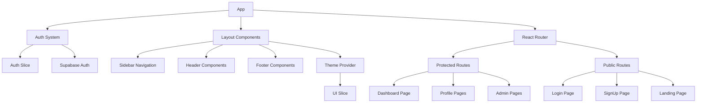
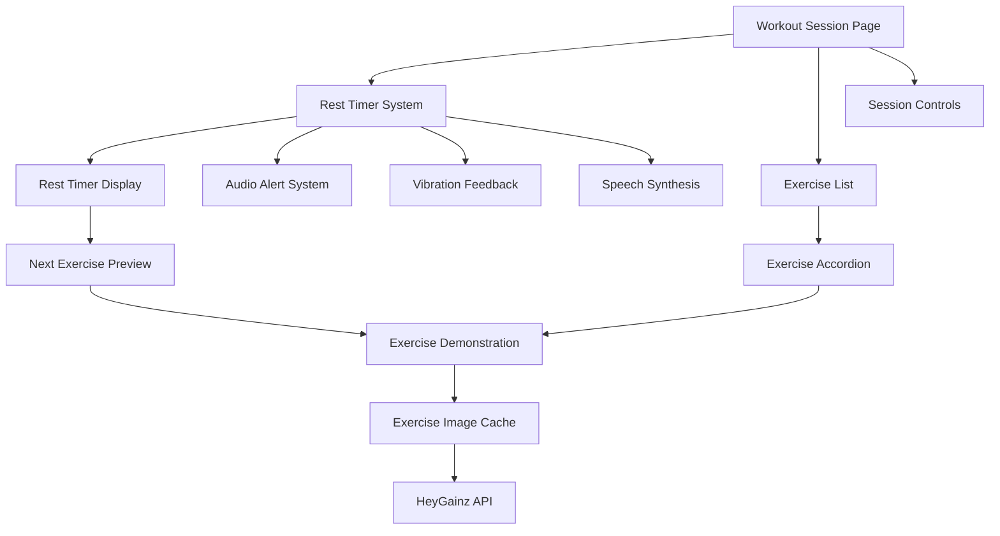
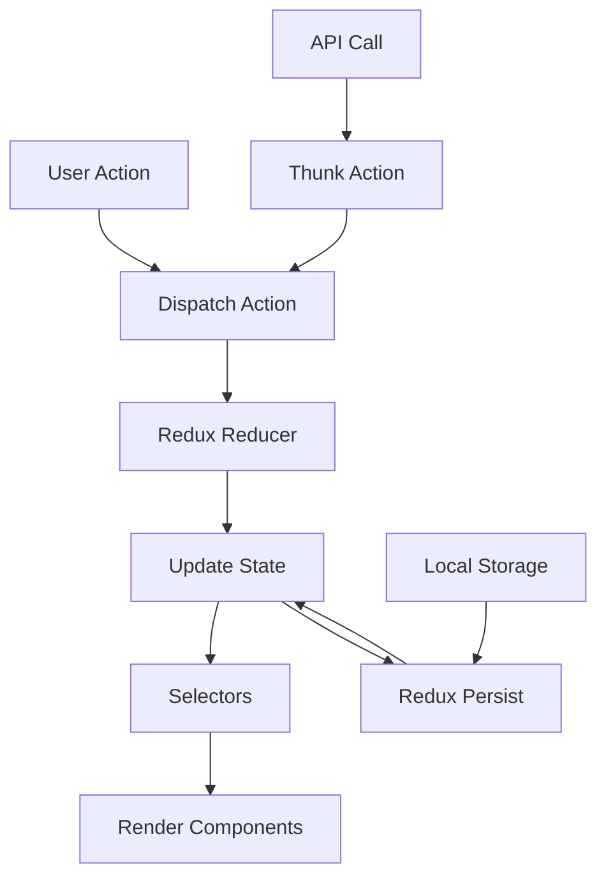

# System Patterns: ENG App

## 1. Architecture Overview

*   **Full-Stack Web Application:** Single Page Application (SPA) frontend with a backend API.
*   **Frontend:** React 18 + Vite, TypeScript, React Router v6 for client-side routing with code-splitting.
*   **Backend/API:** Supabase (BaaS) providing Authentication, PostgreSQL Database (with Row-Level Security), and Storage.
*   **State Management:** Redux Toolkit, with persistence to IndexedDB for offline capabilities (workout data, current meal plan).
*   **Styling:** Tailwind CSS (utility-first approach), including built-in dark mode support.
*   **Forms:** React Hook Form paired with Zod for schema-based validation.
*   **Deployment:** Continuous Integration/Continuous Deployment (CI/CD) via GitHub Actions, deploying to Vercel or Netlify (TBD), including preview deployments.

## 2. Key Technical Decisions & Patterns

*   **Mobile-First Responsive PWA:** The application must be designed for mobile devices primarily and function as a Progressive Web App, including offline caching for specific routes (e.g., workout pages, current meal plan).
*   **Component-Based UI:** Leverage React's component model.
*   **Utility-First CSS:** Use Tailwind CSS for styling.
*   **Schema-Driven Forms:** Employ Zod for robust form validation.
*   **API Integration:** Connect to external APIs (HeyGainz Exercise API) and ingest data from external sources (AFCD Excel file).
*   **Database:** Supabase PostgreSQL with Row Level Security (RLS) enforced.
*   **Authentication:** Supabase Auth using Email Magic Link.
*   **Data Ingestion:** One-time script (`scripts/ingest-afcd.js`) used to populate `food_items` from the AFCD Excel source.

## 3. Data Models (High-Level)

```text
// User Centric Model
User
 ├─ profile: (age, weight, height, bodyFat%, goals, demographics, training habits, nutrition habits, lifestyle info, supplements/meds, motivation)
 ├─ stepGoal: (dailySteps: number)
 ├─ program: (ref → ProgramTemplate)
 ├─ mealPlan: (ref → NutritionPlan)
 └─ checkIns: (array → CheckIn)

// Program Structure
ProgramTemplate
 ├─ name: string
 ├─ phase: string
 ├─ weeks: number
 └─ workouts: (array → ExerciseInstance) // Linked to Exercise DB ID

// Nutrition Structure
NutritionPlan
 ├─ name: string
 ├─ totalCalories: number
 ├─ macros: { protein: number, carbs: number, fat: number }
 └─ meals: (array → MealFoodItem → FoodItem) // Linked to AFCD ID via FoodItem

FoodItem // Populated from AFCD, stored in `food_items` table
 ├─ id: uuid
 ├─ afcd_id: text (unique)
 ├─ food_name: text
 ├─ food_group: text
 ├─ calories_per_100: float8 // Note: Based on nutrient_basis
 ├─ protein_per_100: float8  // Note: Based on nutrient_basis
 ├─ carbs_per_100: float8    // Note: Based on nutrient_basis
 ├─ fat_per_100: float8      // Note: Based on nutrient_basis
 ├─ fiber_per_100: float8    // Note: Based on nutrient_basis
 ├─ serving_size_g: float8
 ├─ serving_size_unit: text
 └─ nutrient_basis: text ('100g' or '100mL') // Indicates unit for nutrient values

MealFoodItem // Junction table: links Meal to FoodItem with quantity
 ├─ meal_id: uuid
 ├─ food_item_id: uuid
 ├─ quantity: float8
 └─ unit: text (e.g., 'g', 'slice', 'cup')

// Check-in Details
CheckIn
 ├─ date: timestamp
 ├─ photos: (array → URL/storage ref)
 ├─ video?: (URL/storage ref)
 ├─ bodyMetrics: { weight: number, measurements: object } // Specific measurements TBD
 ├─ wellnessMetrics: { sleep: number, stress: number, fatigue: number } // Ratings or specific metrics TBD
 └─ adherence: { diet: string, training: string, steps: string, notes: string } // Could be ratings or text
```

*Notes:*
*   The `food_items` table now includes a `nutrient_basis` column. Frontend logic must check this field when displaying or calculating nutrition based on these items.
*   Specific fields within `profile`, `bodyMetrics`, `wellnessMetrics`, and `adherence` require further definition based on the onboarding survey and check-in form details. 

## 4. Dark/Light Mode Implementation Pattern

The application follows a modern React architecture with the following key patterns:

* **Frontend Framework**: React with TypeScript
* **State Management**: Redux with Redux Toolkit
* **Routing**: React Router
* **Forms**: react-hook-form with Zod validation
* **Styling**: Tailwind CSS with custom theme configuration
* **Backend**: Supabase (PostgreSQL + Auth + Storage)
* **Testing**: Vitest with React Testing Library
* **Build Tool**: Vite

### State Management

1. **Redux Store Structure**
   * Feature-based slices
   * Authentication state in `authSlice`
   * User profile data in `profileSlice`
   * Application UI state in `uiSlice`
   * Persisted state with `redux-persist`

2. **API Integration**
   * Custom hooks for data fetching
   * Services for specific API domains (exercises, meals, etc.)
   * Redux Toolkit Query for cached data interactions

### Component Architecture

1. **Page Components**
   * Container components for data fetching and state management
   * Connected to Redux store
   * Manage routing logic
   * Handle authentication/authorization checks

2. **UI Components**
   * Presentational components receiving props
   * Reusable design system elements
   * Styled with Tailwind CSS utilities

3. **Layout Components**
   * Provide consistent structure across pages
   * Handle responsive design adjustments
   * Manage navigation elements

### Routing

1. **Protected Routes**
   * Auth-required routes wrapped in protection
   * Role-based route access (admin, coach, athlete)
   * Redirect logic for unauthorized access

2. **Nested Routes**
   * Feature-based route organization
   * Shared layouts for related routes
   * Route parameters for dynamic content

### Form Handling

1. **Form Validation**
   * Zod schemas for type validation
   * react-hook-form for form state management
   * Custom validation error messages
   * Field-level error handling

2. **Form Components**
   * Reusable input components with consistent styling
   * Form groups for related fields
   * Support for various input types (text, select, radio, etc.)

### Theme System

1. **Dark/Light Mode Toggle**
   * Theme state stored in Redux `uiSlice`
   * User preference persisted in localStorage
   * System preference detection with media query
   * Theme applied through Tailwind CSS classes on the root element
   * Smooth transitions between themes with CSS variables

2. **CSS Variables**
   * Theme colors defined as CSS variables
   * Applied to HTML element based on current theme
   * Consistent color application across components
   * Support for both light and dark modes with appropriate contrast

## Component Relationships



## Workout Session Architecture

The workout session timer and exercise demonstration system follows a sophisticated pattern to enhance the workout experience:



### Exercise Image System

1. **Global Cache Implementation**
   * Uses a global Map to cache exercise images
   * Prevents redundant API calls for the same exercise
   * Caches both by exercise ID and exercise name
   * Persists for the duration of the session

2. **Exercise Demonstration Component**
   * Wrapped in React.memo to prevent unnecessary re-renders
   * Lazy loading of images with loading state
   * Fallback UI for missing or failed images
   * Supports both exercise database IDs and name-based lookups
   * Displays appropriate indicators for GIF animations

3. **API Integration**
   * Primary lookup via fetchExerciseById for direct ID matches
   * Secondary fuzzy search for name-based matching
   * Error handling with appropriate fallbacks
   * Loading states for improved user experience

### Timer System

1. **Rest Timer Implementation**
   * Interval-based countdown with useRef for stability
   * Visual progress indication with percentage calculations
   * Special formatting for countdown display
   * Enhanced visual feedback during final countdown seconds
   * Pause/resume capabilities synchronized with workout state

2. **Multi-Sensory Feedback**
   * **Visual**: Animation, color changes, countdown display
   * **Audio**: End-of-timer sound, countdown beeps
   * **Tactile**: Vibration patterns for mobile devices
   * **Voice**: Speech synthesis announcements

3. **Speech Synthesis**
   * User permission prompt with persistent preference
   * Context-aware announcements based on next exercise or set
   * Visual fallback for browsers without speech support
   * Configurable through user toggle

4. **Mobile Integration**
   * Vibration API with feature detection
   * Different vibration patterns for different events
   * Mobile-specific optimizations for touch interactions

### User Interaction Patterns

1. **Exercise List Navigation**
   * Accordion pattern for viewing/hiding demonstrations
   * Set completion toggles with automatic timer triggering
   * Progress tracking through checkboxes
   * Visual indication of completed exercises

2. **Timer Controls**
   * Skip button for ending rest early
   * Automatic start on set completion
   * Visual countdown during final seconds
   * Next exercise preview for preparation

3. **User Preferences**
   * Voice feedback toggle with persistent storage
   * Permission-based features with clear user prompts
   * Accessibility considerations for all feedback types

### Data Flow

1. **Set Completion**
   * User marks set as complete
   * System checks for rest period requirement
   * Timer initialized with appropriate duration
   * Next exercise information gathered
   * Multi-sensory feedback begins

2. **Timer Completion**
   * Final countdown with enhanced feedback
   * Announcement of next exercise details
   * Return to workout view for next set
   * Audio alert signals timer end

3. **Exercise Demonstration**
   * On-demand loading via toggle
   * Cached images for performance
   * Loading states with spinners
   * Error states with appropriate fallbacks

## State Flow



## Data Schema

Key application data schemas:

1. **User**
   * Basic authentication fields
   * Role-based permissions
   * Profile linkage

2. **Profile**
   * Detailed user information
   * Preferences and settings
   * Onboarding status

3. **Workouts**
   * Exercise collections
   * Scheduling data
   * Progress tracking

4. **Check-ins**
   * Regular progress updates
   * Measurements and metrics
   * Photos and media

5. **Goals**
   * Target objectives
   * Timeframes
   * Progress indicators

## Technical Decisions

1. **TypeScript** for type safety and developer experience
2. **Redux Toolkit** for simplified state management
3. **Supabase** for quick backend implementation
4. **Tailwind CSS** for rapid styling with consistent design
5. **Vite** for fast development and optimized builds
6. **React Router** for declarative routing
7. **PWA Support** for offline capabilities
8. **GitHub Actions** for CI/CD automation

## UI Architecture

### Layout Structure
- **Flex-based Layout Pattern**
  - Root container: `flex flex-col min-h-screen`
  - Main content wrapper: `flex flex-1 overflow-hidden`
  - Sidebar: Fixed width with responsive behavior
  - Content area: `flex-1 flex-col w-0 overflow-hidden`
  - Footer: Outside both sidebar and content for full-width display

- **Responsive Patterns**
  - Desktop: Sidebar and content side-by-side
  - Mobile: Hidden sidebar with slide-in behavior
  - State-based conditional rendering for optimized mobile experiences
  - Table view (desktop) vs. Card view (mobile) for data display

### Navigation
- **Sidebar Navigation**
  - Consistent `NavItem` component shared between layouts
  - Active state indicators with consistent styling
  - Context-specific sections with clear visual separation
  - Cross-navigation between Admin and Main layouts

- **Mobile Navigation**
  - Slide-in animation with transform and transition
  - Semi-transparent backdrop for focus
  - Close button for easy dismissal
  - Hamburger menu toggle in header

### Component Patterns

- **Card-based Content**
  - Consistent padding, border-radius, and shadows
  - White background with dark mode support
  - Clear section headers
  - Proper spacing between content blocks

- **Tables and Lists**
  - Desktop: Full table with all columns
  - Mobile: Card view with key information prominently displayed
  - Status indicators with consistent badge styling
  - Action buttons with appropriate visual hierarchy

- **Form Patterns**
  - Standardized input styling
  - Clear labels and error states
  - Grouped related fields
  - Responsive form layouts

- **Button Patterns**
  - Primary actions: Filled background with strong color
  - Secondary actions: Outlined or lighter background
  - Destructive actions: Red/warning colors
  - Touch-friendly sizing on mobile

## State Management

### Responsive State
- Window resize listener to detect screen size
- State variable to track mobile vs. desktop view
- Conditional rendering based on viewport size
- Responsive behavior without page refresh

### UI State
- Sidebar open/closed state
- Modal visibility state
- Loading and error states
- Filter and selection states

## Accessibility Patterns

- Semantic HTML structure
- Keyboard navigation support
- Screen reader-friendly labeling
- Color contrast compliance
- Focus indicators for interactive elements

## CSS Methodology

- Tailwind CSS utility-first approach
- Dark mode support with `dark:` variant classes
- Responsive design with breakpoint prefixes
- Component extraction for reusable patterns
- Consistent spacing and sizing scale 

## Frontend Architecture

### Responsive Design Patterns

#### Mobile-First Table Design
Tables in the application follow these responsive patterns:
- Use percentage-based column widths (e.g., `w-[15%]`) instead of fixed widths
- Hide less critical columns on mobile with `hidden sm:table-cell` 
- Use `max-w-full` on the table container to prevent horizontal overflow
- Apply `truncate max-w-full` to text elements that might overflow
- Reduce padding on mobile (`px-2 py-3` instead of `px-4 py-3`)
- Make inputs responsive with `w-full` instead of fixed widths like `w-16`

#### Toast Notifications
Toast notifications follow these implementation patterns:
- Use `fixed inset-0 flex items-start justify-center` to position without affecting layout
- Add `pointer-events-none` to ensure clicks pass through to elements beneath
- Use a high z-index (`z-[9999]`) to ensure visibility above all content
- Implement with React state management rather than direct DOM manipulation
- Add timeout cleanup in useEffect to prevent memory leaks
- Limit width with `max-w-[90%]` for better mobile display

#### Floating UI Components
Floating UI components (like timers) follow these patterns:
- Fixed positioning with explicit coordinates (e.g., `fixed bottom-4 right-4`)
- Appropriate z-index to ensure proper stacking context
- Self-contained logic that handles their own state
- Proper cleanup when dismounted or deactivated
- Memoization with React.memo to prevent unnecessary re-renders 

## Exercise Demonstration Patterns

- Exercise demonstrations in the workout session use the HeyGainz API for images and data
- Images are cached in a Map to prevent redundant API calls
- DOM elements are cached separately to prevent GIF reloading issues
- Component is wrapped in React.memo to prevent unnecessary rerenders
- Exercise search uses both direct ID lookup and name-based fuzzy search as fallback
- Images have proper loading states and error handling
- Comprehensive data handling with multiple fallback strategies
- Manual memory/reference management with useRef for handling component unmount
- The component fetches and displays multiple types of supplementary information:
  - Instructions: Step-by-step movement guidance displayed in a gray box
  - Tips: Additional advice displayed in a yellow box 
  - YouTube links: Video demonstrations with branded button
- Text sanitization is applied to instructions and tips to fix encoding issues:
  - Common character encoding problems are fixed via regex replacements
  - Special handling for apostrophes in contractions (don't, can't, etc.)
  - The sanitization function is applied both when caching and setting state

## Data Sanitization Patterns

- External API data often contains encoding issues that need to be sanitized
- A sanitizeText utility function handles common encoding problems:
  - Fixes apostrophes in contractions (don't, can't, won't)
  - Corrects malformed quotes
  - Handles generic instances of encoding issues
- Sanitization is applied at two critical points:
  - When storing data in the cache to ensure clean persistent data
  - When setting state variables to ensure clean displayed data
- Helper function accepts string, null, or undefined inputs for flexibility
- Function follows a defensive programming approach by:
  - Checking for null/undefined before attempting sanitization
  - Using a series of regex replacements for different encoding issues
  - Returning null for invalid inputs to maintain consistent typing

## External API Integration Patterns

- APIs are wrapped in service functions for consistent error handling
- Responses are cached to reduce API calls and improve performance
- Integration with HeyGainz API for exercise data follows a layered approach:
  - Direct ID lookups for known exercises with exact matches
  - Fuzzy search by name as a fallback when IDs aren't available
  - Text matching for similar exercises when exact matches fail
- YouTube links from the API are integrated when available:
  - Links open in a new tab with proper security attributes (rel="noopener noreferrer")
  - Visual consistency with YouTube branding (red button with YouTube logo)
  - Conditionally rendered based on link availability
- All external data is validated and sanitized before display 

## Workout Flow
- Workout session begins when user clicks "Start Workout"
- Each set can be marked as completed, which updates progress percentage
- Completing a set automatically starts a rest timer for the specified duration
- When all sets reach 100% completion, a congratulatory dialog appears
- Confirming completion saves the workout data and navigates to dashboard
- Workout can be manually paused, cancelled, or completed at any time

## Component Structure
- WorkoutSessionPage serves as the container for the entire workout experience
- Exercise components display information and tracking UI for each exercise
- Dialog component is used for multiple purposes (confirmation, cancellation, completion)
- RestTimerDisplay shows countdown and next exercise preview

## State Management
- Local React state manages workout progress and UI state
- Supabase database stores completed sets and workout sessions
- Completion status is calculated on-the-fly based on marked sets 

## Authentication Patterns

### OAuth Integration
- OAuth state is stored in localStorage for persistence across page refreshes
- State includes a UUID for CSRF protection and timestamp for expiration check
- Provider-specific requirements are handled in token exchange:
  - Fitbit: Uses Basic Authentication header with encoded client credentials
  - Google Fit: Sends client ID and secret in request body
- Token refresh follows similar provider-specific patterns

## UI Patterns

### Nutrition and Meal Planning UI

1. **Meal Cards**
   - Dark background (`bg-gray-900`) for improved contrast and readability
   - Consistent header with meal name, calorie count, and macro breakdown
   - Nested information architecture with clear visual hierarchy:
     - Meal name and calories in large font at the top
     - Macronutrient breakdown (P/C/F) directly below in smaller font
     - Food items listed in a structured table format
     - Macronutrient details for each food item displayed beneath the item name

2. **Nutrition Information Display**
   - Consistent format for macronutrients: "P: [value]g · C: [value]g · F: [value]g"
   - Use of centered dot (·) as separator between macro values
   - Calories shown with "kcal" suffix
   - Macros shown with "g" suffix

3. **Table Layouts**
   - Fixed-width tables (`table-fixed`) for consistent column sizes
   - Column width distribution: 50% for item name, 25% for amount, 25% for calories
   - Adequate spacing between columns using padding
   - Food item names in medium weight font for better readability
   - Vertical alignment adjustments for multi-row cells

4. **State Preservation**
   - Using URL parameters to maintain context between views
   - Passing selected filters (e.g., day type) when navigating between related views

### Data Display Patterns

1. **Caloric and Macronutrient Information**
   - Total calories displayed prominently
   - Macronutrients (protein, carbs, fat) displayed together in a consistent format
   - Visual distinction between item-level and aggregate nutritional data

2. **Day Type Filtering**
   - Tab-based or button-based UI for selecting different day types
   - Visual indication of the currently selected day type
   - Filtered content updates immediately upon day type selection

### Food and Meal Hierarchy

1. **Three-Level Structure**
   - Nutrition Plans contain multiple Meals
   - Meals contain multiple Food Items
   - Each level aggregates nutritional data from its children

2. **Nutritional Calculations**
   - Calculate item nutrition based on quantity and per-100g values
   - Aggregate meal nutrition by summing all contained food items
   - Format displayed values consistently with appropriate precision (whole numbers for calories, one decimal place for macros)

## Development Patterns

### Component Structure

1. **Meal Planning Components**
   - `MealPlanView`: Detailed view of a nutrition plan with all meals and food items
   - `MealLoggingWidget`: Dashboard widget for tracking daily meal consumption
   - Integration between these components via consistent URL structure and parameter passing

2. **State Management**
   - Local component state for UI-specific concerns (selected day type, loading states)
   - API calls to fetch nutrition plan data
   - Calculated values for nutritional totals derived from fetched data

3. **Navigation Flow**
   - Dashboard → Meal Plan View with preserved day type
   - Context preservation through URL parameters
   - Consistent back navigation to source screens

## API Integration Patterns

### CORS Handling
- Development environment uses Vite proxy to avoid CORS issues
- Production environment will require server-side proxy or backend API
- API requests include proper authorization headers based on provider requirements

### Data Synchronization
- Step data is fetched from fitness APIs and stored in application database
- Last sync time tracked for each connection
- User can manually trigger synchronization
- APIs return standardized response format regardless of provider 

## Nutrition and Meal Planning UI Patterns

The meal planning and nutrition tracking components follow established UI patterns to ensure consistency and usability throughout the application:

### UI Patterns

1. **Meal Cards**
   * Dark-themed cards with clear visual hierarchy
   * Consistent header styling using `p-4 bg-gray-800`
   * Clear separation between meal header and food item list
   * Expandable/collapsible sections for detailed information

2. **Nutrition Information Display**
   * Consistent presentation of macronutrients in P/C/F order
   * Color coding for macronutrients (protein=red, carbs=yellow, fat=blue)
   * Secondary nutrition information displayed in `text-sm text-gray-400`
   * Progress indicators for macro consumption relative to targets

3. **Table Layouts**
   * Food items displayed in table format with consistent column alignment
   * Optimized column spacing using `pr-4` for readability
   * Macro information displayed beneath food item names
   * Clear visual separation between rows using subtle borders or background alternation

4. **State Preservation**
   * URL parameters maintain selected day type when navigating between views
   * User selections persist across navigation boundaries
   * Query parameters encode user context (e.g., `?dayType=moderate`)

### Data Display Patterns

1. **Caloric and Macronutrient Information**
   * Total calories prominently displayed
   * Macronutrient distribution shown as both grams and percentages
   * Visual progress indicators for daily consumption
   * Clear distinction between consumed, remaining, and target values

2. **Day Type Filtering**
   * Consistent support for four day types (Rest, Light, Moderate, Heavy)
   * Tab-style selectors for day types in dashboard widgets
   * Day type selections preserved when navigating to detailed views
   * Visual indicators for current day type selection

### Food and Meal Hierarchy

1. **Three-Level Structure**
   * Nutrition plans contain multiple meals
   * Meals contain multiple food items
   * Food items display individual nutritional information

2. **Nutritional Calculations**
   * Automatic calculation of calories and macros based on food quantities
   * Aggregation of nutritional values at meal and daily levels
   * Target vs. actual calculations for tracking adherence
   * Remaining nutrient calculations for day-of meal planning

### Development Patterns

1. **Component Structure**
   * `MealLoggingWidget`: Dashboard component for daily meal tracking
   * `MealPlanView`: Detailed view of complete nutrition plan
   * `AddExtraMealModal`: Common pattern for adding unplanned meals
   * Shared utility functions for nutritional calculations

2. **State Management**
   * Local component state for UI interactions
   * Redux for shared nutrition data
   * URL parameters for cross-component state preservation

3. **Navigation Flow**
   * Dashboard widgets link to detailed views with context preserved
   * "View Plan" buttons include current day type as a parameter
   * Consistent back navigation patterns to return to previous context 