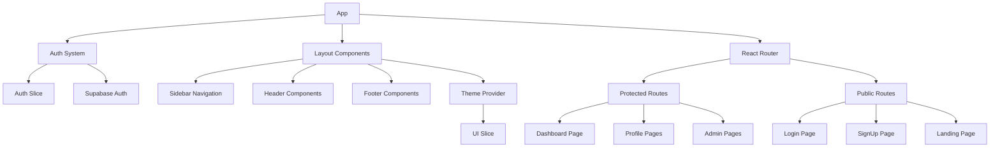
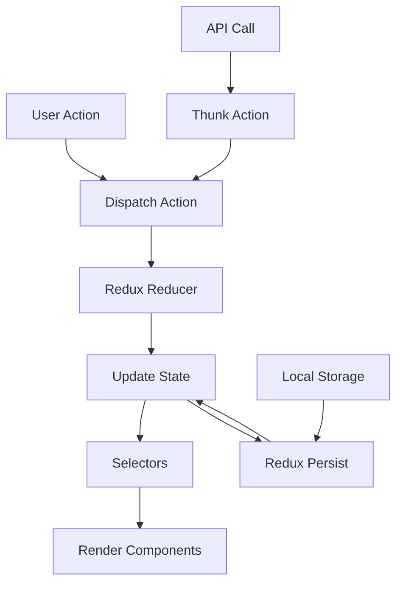

# System Patterns: ENG App

## 1. Architecture Overview

*   **Full-Stack Web Application:** Single Page Application (SPA) frontend with a backend API.
*   **Frontend:** React 18 + Vite, TypeScript, React Router v6 for client-side routing with code-splitting.
*   **Backend/API:** Supabase (BaaS) providing Authentication, PostgreSQL Database (with Row-Level Security), and Storage.
*   **State Management:** Redux Toolkit, with persistence to IndexedDB for offline capabilities (workout data, current meal plan).
*   **Styling:** Tailwind CSS (utility-first approach), including built-in dark mode support.
*   **Forms:** React Hook Form paired with Zod for schema-based validation.
*   **Deployment:** Continuous Integration/Continuous Deployment (CI/CD) via GitHub Actions, deploying to Vercel or Netlify (TBD), including preview deployments.

## 2. Key Technical Decisions & Patterns

*   **Mobile-First Responsive PWA:** The application must be designed for mobile devices primarily and function as a Progressive Web App, including offline caching for specific routes (e.g., workout pages, current meal plan).
*   **Component-Based UI:** Leverage React's component model.
*   **Utility-First CSS:** Use Tailwind CSS for styling.
*   **Schema-Driven Forms:** Employ Zod for robust form validation.
*   **API Integration:** Connect to external APIs (wger Exercise DB) and ingest data from external sources (AFCD Excel file).
*   **Database:** Supabase PostgreSQL with Row Level Security (RLS) enforced.
*   **Authentication:** Supabase Auth using Email Magic Link.
*   **Data Ingestion:** One-time script (`scripts/ingest-afcd.js`) used to populate `food_items` from the AFCD Excel source.

## 3. Data Models (High-Level)

```text
// User Centric Model
User
 ├─ profile: (age, weight, height, bodyFat%, goals, demographics, training habits, nutrition habits, lifestyle info, supplements/meds, motivation)
 ├─ stepGoal: (dailySteps: number)
 ├─ program: (ref → ProgramTemplate)
 ├─ mealPlan: (ref → NutritionPlan)
 └─ checkIns: (array → CheckIn)

// Program Structure
ProgramTemplate
 ├─ name: string
 ├─ phase: string
 ├─ weeks: number
 └─ workouts: (array → ExerciseInstance) // Linked to Exercise DB ID

// Nutrition Structure
NutritionPlan
 ├─ name: string
 ├─ totalCalories: number
 ├─ macros: { protein: number, carbs: number, fat: number }
 └─ meals: (array → MealFoodItem → FoodItem) // Linked to AFCD ID via FoodItem

FoodItem // Populated from AFCD, stored in `food_items` table
 ├─ id: uuid
 ├─ afcd_id: text (unique)
 ├─ food_name: text
 ├─ food_group: text
 ├─ calories_per_100: float8 // Note: Based on nutrient_basis
 ├─ protein_per_100: float8  // Note: Based on nutrient_basis
 ├─ carbs_per_100: float8    // Note: Based on nutrient_basis
 ├─ fat_per_100: float8      // Note: Based on nutrient_basis
 ├─ fiber_per_100: float8    // Note: Based on nutrient_basis
 ├─ serving_size_g: float8
 ├─ serving_size_unit: text
 └─ nutrient_basis: text ('100g' or '100mL') // Indicates unit for nutrient values

MealFoodItem // Junction table: links Meal to FoodItem with quantity
 ├─ meal_id: uuid
 ├─ food_item_id: uuid
 ├─ quantity: float8
 └─ unit: text (e.g., 'g', 'slice', 'cup')

// Check-in Details
CheckIn
 ├─ date: timestamp
 ├─ photos: (array → URL/storage ref)
 ├─ video?: (URL/storage ref)
 ├─ bodyMetrics: { weight: number, measurements: object } // Specific measurements TBD
 ├─ wellnessMetrics: { sleep: number, stress: number, fatigue: number } // Ratings or specific metrics TBD
 └─ adherence: { diet: string, training: string, steps: string, notes: string } // Could be ratings or text
```

*Notes:*
*   The `food_items` table now includes a `nutrient_basis` column. Frontend logic must check this field when displaying or calculating nutrition based on these items.
*   Specific fields within `profile`, `bodyMetrics`, `wellnessMetrics`, and `adherence` require further definition based on the onboarding survey and check-in form details. 

## 4. Dark/Light Mode Implementation Pattern

The application follows a modern React architecture with the following key patterns:

* **Frontend Framework**: React with TypeScript
* **State Management**: Redux with Redux Toolkit
* **Routing**: React Router
* **Forms**: react-hook-form with Zod validation
* **Styling**: Tailwind CSS with custom theme configuration
* **Backend**: Supabase (PostgreSQL + Auth + Storage)
* **Testing**: Vitest with React Testing Library
* **Build Tool**: Vite

### State Management

1. **Redux Store Structure**
   * Feature-based slices
   * Authentication state in `authSlice`
   * User profile data in `profileSlice`
   * Application UI state in `uiSlice`
   * Persisted state with `redux-persist`

2. **API Integration**
   * Custom hooks for data fetching
   * Services for specific API domains (exercises, meals, etc.)
   * Redux Toolkit Query for cached data interactions

### Component Architecture

1. **Page Components**
   * Container components for data fetching and state management
   * Connected to Redux store
   * Manage routing logic
   * Handle authentication/authorization checks

2. **UI Components**
   * Presentational components receiving props
   * Reusable design system elements
   * Styled with Tailwind CSS utilities

3. **Layout Components**
   * Provide consistent structure across pages
   * Handle responsive design adjustments
   * Manage navigation elements

### Routing

1. **Protected Routes**
   * Auth-required routes wrapped in protection
   * Role-based route access (admin, coach, athlete)
   * Redirect logic for unauthorized access

2. **Nested Routes**
   * Feature-based route organization
   * Shared layouts for related routes
   * Route parameters for dynamic content

### Form Handling

1. **Form Validation**
   * Zod schemas for type validation
   * react-hook-form for form state management
   * Custom validation error messages
   * Field-level error handling

2. **Form Components**
   * Reusable input components with consistent styling
   * Form groups for related fields
   * Support for various input types (text, select, radio, etc.)

### Theme System

1. **Dark/Light Mode Toggle**
   * Theme state stored in Redux `uiSlice`
   * User preference persisted in localStorage
   * System preference detection with media query
   * Theme applied through Tailwind CSS classes on the root element
   * Smooth transitions between themes with CSS variables

2. **CSS Variables**
   * Theme colors defined as CSS variables
   * Applied to HTML element based on current theme
   * Consistent color application across components
   * Support for both light and dark modes with appropriate contrast

## Component Relationships



## State Flow



## Data Schema

Key application data schemas:

1. **User**
   * Basic authentication fields
   * Role-based permissions
   * Profile linkage

2. **Profile**
   * Detailed user information
   * Preferences and settings
   * Onboarding status

3. **Workouts**
   * Exercise collections
   * Scheduling data
   * Progress tracking

4. **Check-ins**
   * Regular progress updates
   * Measurements and metrics
   * Photos and media

5. **Goals**
   * Target objectives
   * Timeframes
   * Progress indicators

## Technical Decisions

1. **TypeScript** for type safety and developer experience
2. **Redux Toolkit** for simplified state management
3. **Supabase** for quick backend implementation
4. **Tailwind CSS** for rapid styling with consistent design
5. **Vite** for fast development and optimized builds
6. **React Router** for declarative routing
7. **PWA Support** for offline capabilities
8. **GitHub Actions** for CI/CD automation 